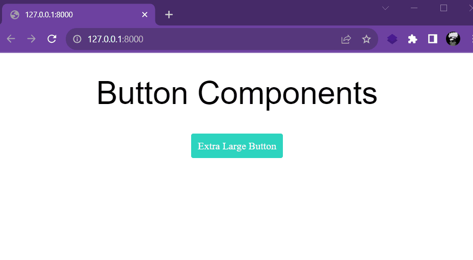

# Try **fastn**

`fastn` [Champion Challenges](https://fastn.com/champion-program/) Solutions


### 

Sl. No.| Challenge  | Solution | PoC |
|:----:|:----------:|:--------:|:---:|
| 1    |Create a Button |[task1](/task1)||
| 2    |Create a login page UI |[task2](/task2)||
| 3    |Create a bio-link page |[task3](/task3)||
| 4    | Create an expander UI |[task4](/task4)||
| 5    |Create a colour package |[task5](/task5)||
| 6    |Create a typography package |[task6](/task6)||
| 7    |Create a portfolio page |[task7](/task7)||
| 8    |Create a submission form page |[task8](/task8)||
| 9    |Create a blog site |[task9](/task9)||
| 10    |Create a multi-page design layout |[task10](/task10)||

# Install fastn
Link ### https://fastn.com/install


# Usage

### Goto task folders and run 
    ```bash
    $ fastn serve
    ### Server Started ###
    Go to: http://127.0.0.1:8000
    ```

# References

### https://fastn.com/home